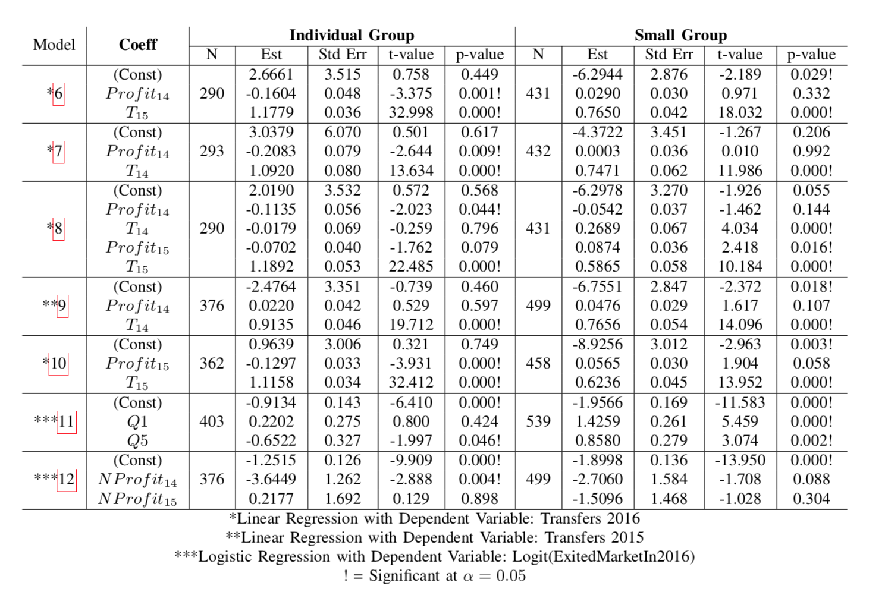

# Results

## Within Year Analysis

Values in the right-most 3 columns are: Pearson r correlation coefficient (p-value).

| Year | Group       | N   | Premium v Transfers | Costs v Transfers | Costs v Premiums |
|------|-------------|-----|---------------------|-------------------|------------------|
| 2014 | individual  | 403 | 0.2898 (<1e-4)      | 0.6666 (<1e-4)    | 0.6300 (<1e-4)   |
|      | small group | 539 | 0.0098 (0.821)      | 0.1524 (4e-4)     | 0.7664 (<1e-4)   |
| 2015 | individual  | 453 | 0.3993 (<1e-4)      | 0.7196 (<1e-4)    | 0.6316 (<1e-4)   |
|      | small group | 542 | 0.1138 (0.008)      | 0.1947 (<1e-4)    | 0.6443 (<1e-4)   |
| 2016 | individual  | 420 | 0.4221 (<1e-4)      | 0.8319 (<1e-4)    | 0.6372 (<1e-4)   |
|      | small group | 475 | 0.2429 (<1e-4)      | 0.2509 (<1e-4)    | 0.5983 (<1e-4)   |

## Between Year Analysis

| Model Number | Model                         |
|--------------|-------------------------------|
| 6            | T16 ~ P14 + T15               |
| 7            | T16 ~ P14 + T14               |
| 8            | T16 ~ P14 + T14 + P15 + T15   |
| 9            | T15 ~ P14 + T14               |
| 10           | T16 ~ P15 + T15               |
| 11           | EM16 ~ Q1 + Q5                |
| 12           | EM16 ~ P14* + P15*            |

Where each variable has the following definition (note reinsurance is defined only in the individual marketplace, so it does not apply in the small group marketplace):

| Variable | Meaning                                                                                      |
|----------|----------------------------------------------------------------------------------------------|
| T        | Transfers per member month in a given year (14, 15, 16)                                      |
| P        | Profit per member month in a given year (Premiums + Transfers + Reinsurance - Costs)         |
| EM       | Dichotomous variable: 1 if a company has exited the market in a given year; 0 otherwise      |
| Q        | Dichotomous variable: 1 if a company's 2014 losses puts it in a given quintile; 0 otherwise  |

A * indicates that the variable has been normalized by subtracting the mean and dividing by the range. Q1 indicates that a company has lost a lot of money, and Q5 indicates that a company has lost little money (perhaps even gained money).

